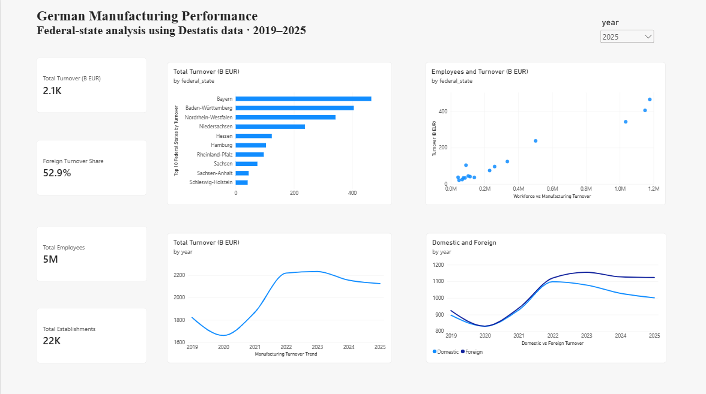

<div align="center">

# Germany Manufacturing Performance Analytics

**SQL · Power BI · Power Query · DAX · SQLite · Official Destatis Data**

A business-oriented analysis of German manufacturing performance across all 16 federal states, covering turnover, employment, export orientation, regional concentration, and changes from 2019 to 2025.

</div>

<p align="center">
  
  
  
  
  
</p>

## Dashboard



The Power BI dashboard provides an interactive view of German manufacturing performance with a year selector and four analytical perspectives:

- headline KPIs for turnover, foreign-turnover share, employment, and establishments;
- manufacturing turnover trend from 2019 to 2025;
- federal-state turnover ranking for the selected year;
- domestic versus foreign turnover over time;
- workforce size versus manufacturing turnover across federal states.

## Project Overview

This project uses official manufacturing statistics from the **Statistisches Bundesamt (Destatis) GENESIS-Online** database to examine how manufacturing activity differs across German federal states and how key indicators changed between 2019 and 2025.

The analysis combines data preparation in **Power Query**, structured querying in **SQLite/SQL**, and interactive reporting with **Power BI and DAX**.

| Item | Scope |
| --- | --- |
| Data source | Destatis GENESIS-Online |
| Table | `42111-0010` |
| Primary analysis period | 2019–2025 |
| Geographic coverage | 16 German federal states |
| Processed observations | 112 state-year records |
| Processed fields | 11 analytical columns |
| Main tools | SQL, SQLite, Power Query, Power BI, DAX |

## Business Questions

The project is structured around practical analytical questions:

1. Which federal states generate the highest manufacturing turnover?
2. How did manufacturing turnover change between 2019 and 2025?
3. Which states have the highest foreign-turnover share?
4. How large is the manufacturing workforce in each state, and how does turnover per employee differ?
5. How did total turnover, employment, establishments, and foreign-turnover share evolve over time?

## Key Findings

- Reported manufacturing turnover across the 16 states reached approximately **€2,125.0 billion in 2025**, compared with **€1,820.9 billion in 2019**, an increase of about **16.7% in nominal terms**.
- **Bayern** led 2025 manufacturing turnover with approximately **€465.6 billion**, followed by **Baden-Württemberg (€405.4B)** and **Nordrhein-Westfalen (€342.7B)**. Together, these three states represented about **57.1%** of 2025 turnover in the dataset.
- Foreign turnover represented **52.9%** of total reported manufacturing turnover in 2025, up from **50.8%** in 2019.
- **Bremen** had the highest foreign-turnover share in 2025 at **68.4%**, while Bayern generated the largest foreign-turnover amount in absolute terms.
- The annual series shows a **-8.8%** nominal turnover change in 2020, followed by strong increases in 2021 and 2022. Turnover then changed by **+0.6% in 2023**, **-3.5% in 2024**, and **-1.4% in 2025**.
- Between 2019 and 2025, manufacturing employment decreased from about **5.70 million to 5.45 million**, while the number of establishments decreased from **23,337 to 22,217**.
- **Mecklenburg-Vorpommern** recorded the largest percentage increase in nominal turnover between 2019 and 2025 (**+62.5%**) from a relatively small base, while **Bayern** recorded the largest absolute increase (**+€101.5B**).
- **Saarland** was the only federal state in this comparison with lower nominal turnover in 2025 than in 2019 (**-5.3%**).

## Data Preparation

The original Destatis CSV is preserved unchanged in [`data/raw`](data/raw/).

Power Query was used to create the analytical dataset through the following steps:

1. parsed the semicolon-delimited Destatis source;
2. removed source metadata/header rows;
3. restricted the analysis to **2019–2025**;
4. removed repeated status-marker fields from the analytical table;
5. renamed German source fields to consistent analyst-friendly English names;
6. assigned appropriate text and whole-number data types;
7. checked column quality for missing values and conversion errors;
8. verified that every `federal_state + year` combination occurs exactly once.

The resulting dataset contains **112 rows** (`16 states × 7 years`) and **11 columns**.

The processed dataset is available at:

[`data/processed/manufacturing_by_state_2019_2025.csv`](data/processed/manufacturing_by_state_2019_2025.csv)

The Power Query workbook is preserved at:

[`excel/manufacturing_data_cleaning.xlsx`](excel/manufacturing_data_cleaning.xlsx)

## SQL Analysis

The cleaned dataset was imported into SQLite and analyzed with five focused SQL queries.

| Analysis | SQL file | Techniques |
| --- | --- | --- |
| 2025 state turnover ranking and share | [`01_state_turnover_ranking.sql`](sql/01_state_turnover_ranking.sql) | filtering, sorting, window aggregation |
| 2019–2025 turnover change | [`02_turnover_change_2019_2025.sql`](sql/02_turnover_change_2019_2025.sql) | CTE, `CASE`, aggregation |
| 2025 foreign-turnover orientation | [`03_export_orientation_2025.sql`](sql/03_export_orientation_2025.sql) | ratios, filtering, ranking |
| Employment and turnover per employee | [`04_employment_turnover_per_employee_2025.sql`](sql/04_employment_turnover_per_employee_2025.sql) | calculated metrics, ranking |
| Annual manufacturing trend | [`05_annual_manufacturing_trend.sql`](sql/05_annual_manufacturing_trend.sql) | CTEs, `SUM`, `LAG()` window function, YoY analysis |

The SQLite database is included at:

[`database/germany_manufacturing.db`](database/germany_manufacturing.db)

## Power BI and DAX

The Power BI report uses reusable DAX measures rather than fixed dashboard values. This allows the KPI cards and regional visuals to react dynamically to the selected year.

Core measures include:

```DAX
Total Turnover (B EUR) =
DIVIDE(
    SUM(Manufacturing[total_turnover_thousand_eur]),
    1000000
)
```

```DAX
Foreign Turnover Share =
DIVIDE(
    [Foreign Turnover (B EUR)],
    [Total Turnover (B EUR)]
)
```

Additional measures calculate:

- domestic turnover;
- foreign turnover;
- total employees;
- total establishments.

The report file is available at:

[`powerbi/germany_manufacturing_dashboard.pbix`](powerbi/germany_manufacturing_dashboard.pbix)

## Repository Structure

```text
germany-manufacturing-performance-analytics/
│
├── README.md
├── data/
│   ├── raw/
│   │   ├── 42111-0010_de.csv
│   │   └── SOURCE.md
│   └── processed/
│       └── manufacturing_by_state_2019_2025.csv
│
├── database/
│   └── germany_manufacturing.db
│
├── excel/
│   └── manufacturing_data_cleaning.xlsx
│
├── sql/
│   ├── 01_state_turnover_ranking.sql
│   ├── 02_turnover_change_2019_2025.sql
│   ├── 03_export_orientation_2025.sql
│   ├── 04_employment_turnover_per_employee_2025.sql
│   └── 05_annual_manufacturing_trend.sql
│
├── powerbi/
│   └── germany_manufacturing_dashboard.pbix
│
└── docs/
    └── screenshots/
        └── dashboard_overview.png
```

## Data Source and Licence

**Source:** Statistisches Bundesamt (Destatis), GENESIS-Online  
**Table:** `42111-0010` — manufacturing establishments, employment and turnover by German federal state and year  
**Original source coverage:** 2005–2025  
**Primary analysis period:** 2019–2025

The original source file is retained without modification in the repository.

GENESIS-Online data is provided under the **Data Licence Germany — Attribution — Version 2.0**.

Source attribution:

> © Statistisches Bundesamt (Destatis)

Additional source information is documented in [`data/raw/SOURCE.md`](data/raw/SOURCE.md).

## Analytical Limitations

- Turnover values are **nominal** and are not adjusted for inflation; changes should not be interpreted as real output growth.
- `turnover per employee` is a descriptive ratio and is **not treated as a productivity measure**.
- The dataset contains aggregated state-level statistics rather than company-level transactions.
- Cost and profit information is not available, so profitability and profit-margin metrics are intentionally not calculated.
- Differences between states can reflect industry composition, capital intensity, price effects, and other structural factors not isolated by this analysis.

## Reproducing the Analysis

Clone the repository:

```bash
git clone https://github.com/Meeran16/germany-manufacturing-performance-analytics.git
cd germany-manufacturing-performance-analytics
```

Then:

- open `database/germany_manufacturing.db` with SQLite-compatible software to inspect the analytical database;
- run the scripts in `sql/` to reproduce the SQL analyses;
- open `excel/manufacturing_data_cleaning.xlsx` to review the Power Query preparation workflow;
- open `powerbi/germany_manufacturing_dashboard.pbix` in Power BI Desktop to explore the interactive dashboard.

---

<div align="center">

**Official German data → Power Query → SQLite / SQL → DAX → Power BI**

</div>
